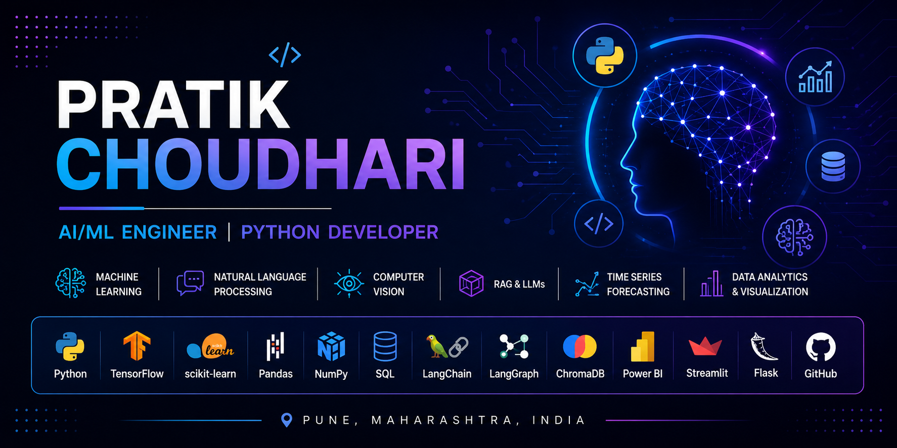

  

# Hi 👋, I'm Pratik Choudhari

## AI/ML Engineer | Python Developer | Data Science

I build AI, Machine Learning, NLP, Computer Vision, Time Series Forecasting, and Retrieval-Augmented Generation (RAG) applications using Python.

My work includes end-to-end AI projects involving data preprocessing, model development, evaluation, deployment, and interactive dashboards.

---

# 👨‍💻 About Me

- 🎓 B.Tech in Information Technology
- 🤖 AI/ML Engineer
- 🐍 Python Developer
- 📊 Data Science & Data Analytics

- ✅ Built projects in:
  - Machine Learning
  - Deep Learning
  - Natural Language Processing (NLP)
  - Computer Vision
  - Time Series Forecasting
  - Retrieval-Augmented Generation (RAG)

- ✅ Working knowledge of:
  - REST APIs
  - Flask
  - Streamlit
  - AWS (Basic)
  - Git & GitHub

- ✅ Strong foundation in:
  - Python
  - SQL
  - Object-Oriented Programming
  - DBMS
  - Data Structures & Algorithms

---

# 🛠 Tech Stack

## Programming

- Python
- SQL

## Machine Learning & Deep Learning

- Scikit-learn
- TensorFlow
- Pandas
- NumPy
- Matplotlib
- Seaborn

## AI / NLP / LLM

- RAG
- LangChain
- LangGraph
- ChromaDB
- NLP

## Data Analytics

- Power BI
- Microsoft Excel

## Web & Deployment

- Flask
- REST APIs
- Streamlit

## Cloud & Tools

- Git
- GitHub
- VS Code
- Jupyter Notebook
- AWS (Basic)

---

# ⭐ Featured Projects

- Multi-Agent RAG System
- Medical Text Classification using NLP
- Traffic Sign Detection
- Rainfall Time Series Forecasting
- Air Temperature Time Series Forecasting
- Employee Management System
- HR Dashboard (Power BI)
- Sales Dashboard (Excel)
- Pneumonia Chest X-ray Classification

---

# 💼 Experience

### AI/ML Intern – Rubixe

- Developed AI and Machine Learning solutions using Python.
- Worked on data preprocessing, model development, evaluation, and visualization.
- Applied Machine Learning and Deep Learning techniques on real-world datasets.

---

# 📜 Certifications

- NPTEL – Introduction to Machine Learning (Elite + Silver)
- AI Engineer Program – DataMites
- AI/ML Internship – Rubixe

---

# 📫 Connect with Me

📧 Email: **pratikchoudhari222@gmail.com**

💼 LinkedIn: **www.linkedin.com/in/pratik-choudhari-ai21**

🐙 GitHub: **github.com/PratikChoudhari21**
